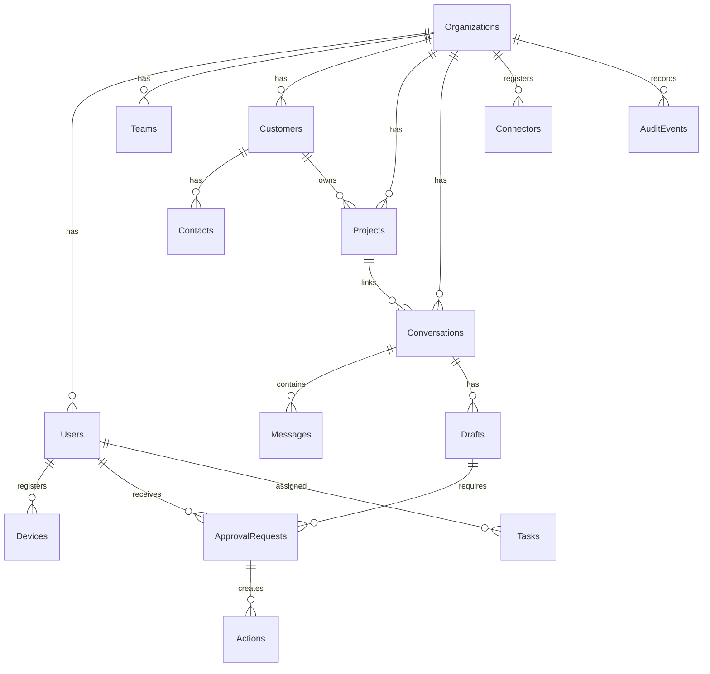

# ERD Notes

```mermaid
erDiagram
    Organizations ||--o{ Users : has
    Organizations ||--o{ Teams : has
    Organizations ||--o{ Customers : has
    Organizations ||--o{ Projects : has
    Organizations ||--o{ Conversations : has
    Users ||--o{ Devices : registers
    Users ||--o{ ApprovalRequests : receives
    Users ||--o{ Tasks : assigned
    Customers ||--o{ Contacts : has
    Customers ||--o{ Projects : owns
    Projects ||--o{ Conversations : links
    Conversations ||--o{ Messages : contains
    Conversations ||--o{ Drafts : has
    Drafts ||--o{ ApprovalRequests : requires
    ApprovalRequests ||--o{ Actions : creates
    Organizations ||--o{ Connectors : registers
    Organizations ||--o{ AuditEvents : records
```
